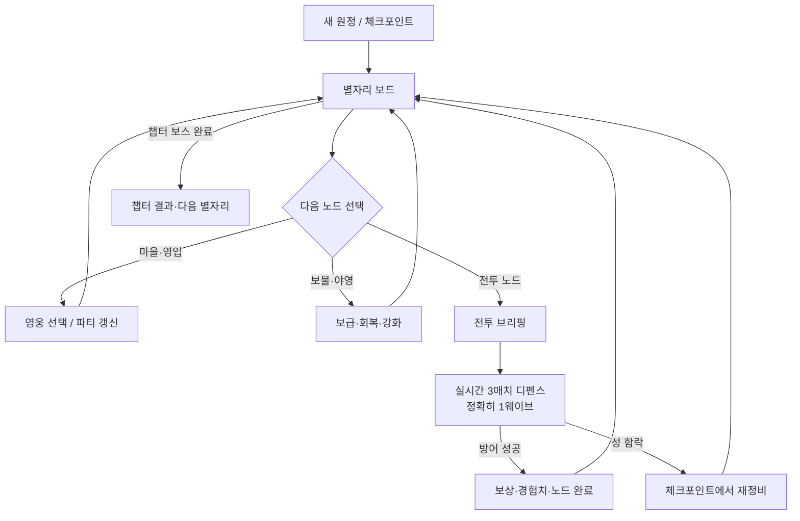
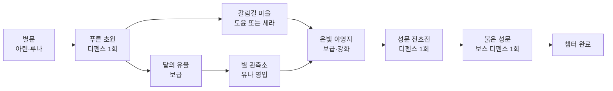

# 게임 흐름 결정안: 보드와 단일 디펜스의 왕복

- 상태: 제안 · 구현 전 확정 필요
- 적용 대상: `Constellation Defense` 공개 게임
- 작성일: 2026-08-11

## 한 줄 결정

**보드는 전략을 결정하는 메인 화면이고, 한 번의 디펜스는 정확히 한 웨이브만 진행한 뒤 즉시 보드로 돌아온다.**

이 리듬이면 3매치 전투의 긴장감은 유지하면서도, 영웅 영입·경로·보급의 선택이 전투 사이에 다시 읽힌다. 여러 웨이브를 한 화면에서 연달아 치르면 보드가 장식처럼 밀리고, 반대로 전투가 너무 짧으면 3매치의 판단이 의미를 잃는다. 목표 전투 길이는 첫 전투 45–70초, 일반 전투 60–100초다.

## 현재 구현과 차이

현재 첫 챕터는 `푸른 초원`에서 2웨이브, `붉은 성문`에서 5웨이브를 끝낸 뒤에만 보드로 복귀한다. 즉, **노드 완료 뒤에는 보드로 돌아오지만, 웨이브 하나마다 돌아오지는 않는다.** 이 문서는 이를 단일 웨이브 왕복으로 바꾸는 다음 구현 단위의 기준이다.

## 권장 전체 흐름

### 화면별 역할

| 화면 | 플레이어가 결정하는 것 | 끝나는 조건 |
| --- | --- | --- |
| 별자리 보드 | 다음 경로, 영입, 보급 사용, 영웅 전문화·성 강화 | 다음 노드 선택 |
| 전투 브리핑 | 적 위협, 보상, 선택한 파티와 길을 마지막 확인 | `방어 시작` |
| 디펜스 | 실시간 3매치 스왑으로 Flare/Tide/Bloom을 어느 길에 쓸지 판단 | 웨이브 1회 성공 또는 성 함락 |
| 결과 | 경험치·보상·새로 열린 길을 확인 | 자동으로 보드 복귀 |

브리핑은 별도 복잡한 메뉴가 아니라 2초 내에 읽히는 짧은 전환이다. 보드의 달빛·별길 색을 유지한 채 전장으로 카메라가 내려간다는 인상을 주고, 전체 화면 점멸은 쓰지 않는다.

전투 HUD·시작 버튼·적 수 안내·완료 토스트는 모두 `장소명 · 방어 1/2` 형식으로 같은 단계를 표시한다. 플레이어는 현재 몇 번째 방어인지와 보드로 돌아가기까지 남은 횟수를 어느 화면에서도 추측하지 않아야 한다.

## 첫 챕터의 권장 리듬

- `푸른 초원`: 전술판과 세 길을 익히는 한 번의 방어.
- `달의 유물 → 별 관측소`: 보급과 유나를 얻는 안정 경로.
- `갈림길 마을`: 도윤의 저지 또는 세라의 화력을 고르는 공격적 경로.
- `성문 전초전 → 붉은 성문`: 보스전을 길게 5웨이브로 묶지 않고, 각각 한 번의 방어로 나눈다. 두 전투 사이에는 보드가 보이고, 야영에서 고른 성장·보급이 다음 전투에 반영된다.

보스가 더 긴 위협으로 느껴져야 하면 보스 노드를 2–3개의 연결 노드로 늘린다. 단, 각 단계 뒤에는 반드시 보드로 돌아온다. 이렇게 하면 보스가 "웨이브 묶음"이 아니라 지도에서 전진하는 목적지로 읽힌다.

## 유지해야 하는 것

- 실제 전투의 핵심은 계속 **실시간 3매치 → 선택한 열의 Flare/Tide/Bloom**이다.
- 영웅 경험치, 전문화, 성 내구도, 골드는 원정 전체에 유지한다.
- 전투 승리 뒤에는 해당 전투 노드만 완료 처리하고, 다음 적을 자동으로 소환하지 않는다.
- 보드에서 파티 구성과 강화가 바뀐 결과가 바로 다음 단일 디펜스의 체감 차이로 이어져야 한다.

## 실패와 체크포인트

첫 구현에서는 성이 함락되면 가장 가까운 `야영` 또는 챕터 시작으로 되돌린다. 보스에서 실패했을 때 전체 챕터를 처음부터 반복하게 만들지 않도록, 야영 노드는 명시적인 체크포인트로 쓴다. 영입과 영웅 레벨은 유지하고, 성 내구도·해당 전투 보상만 체크포인트 기준으로 되돌리는 편이 공정하고 덜 지친다.

## 구현 기준

1. 일반 전투·보스 단계 모두 `waves: 1`로 둔다. 보스의 길이는 연결된 보스 노드 수로 표현한다.
2. 웨이브 종료 이벤트는 다음 웨이브 준비 상태가 아니라 `journey` 상태로 전환하고, 보상 처리 뒤 지도로 복귀한다.
3. 전투판 저장 공정성을 명확히 한다. 보드의 별 배열이 다음 전투에 유지된다면 저장 데이터에 배열·선택·RNG 상태를 넣고, 유지하지 않는다면 매 전투 시작에 시드 기반으로 새 보드를 만들고 UI에 알린다.
4. 자동 데모와 밸런스 봇은 지도 선택 → 영입 → 단일 디펜스 → 지도 복귀를 실제 플레이와 같은 순서로 실행한다.
5. 결정적 테스트는 한 전투 성공 뒤 적이 더 스폰되지 않고 `journey`로 복귀하는지, 보스 단계 사이에 보드가 열리는지, 체크포인트 복원이 파티·성·보상을 올바르게 되돌리는지 확인한다.

## 완료 판정

- 첫 전투를 이기면 1초 안에 별자리 보드가 다시 보인다.
- 보드에서 영입/보급/강화의 이유를 읽은 뒤 다음 전투를 고를 수 있다.
- 보스도 긴 자동 웨이브 묶음이 아니라 보드 위의 2–3개 단계로 보인다.
- 3매치 보드가 여전히 전투의 가장 자주 쓰는 능동 입력이며, 지도는 이를 대체하지 않는다.
